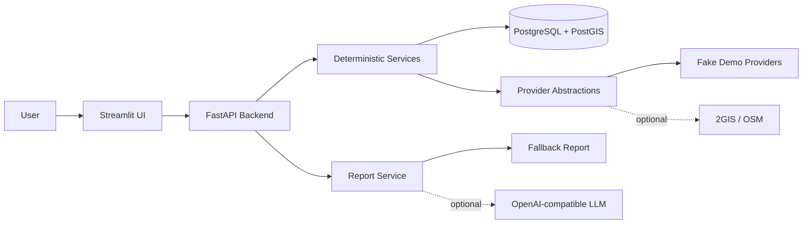

# PlaceFit — оценка локации под ПВЗ

PlaceFit — production-oriented MVP для оценки одного конкретного адреса в Краснодаре под пункт выдачи заказов. Backend детерминированно считает конкурентов, score, confidence, финансы и итоговое решение; LLM, если включён, только объясняет уже подготовленный JSON.

Статус: **MVP / local demo ready после Фазы 10**. Обычный demo path работает без внешних API keys и без LLM key: используются fake geodata providers и fallback report.

## MVP Scope

- Один город: Краснодар.
- Один `business_type`: `pvz`.
- Один адрес за анализ.
- FastAPI backend + PostgreSQL/PostGIS + Streamlit UI.
- Mocked/fallback path работает без `DGIS_API_KEY`, `LLM_API_KEY` и других real keys.
- Принцип: **AI объясняет, код считает**.

## Non-Goals

В MVP нет ML-прогноза выручки, auth/multi-user режима, Telegram-бота, H3/heatmap, city-wide search, trendwatcher, browser-agent и парсинга Avito/Cian. PlaceFit не гарантирует прибыль и не заменяет ручную проверку требований маркетплейсов.

## Architecture



LLM не имеет доступа к БД, shell, внешним API или секретам. Scoring, finance, confidence и decision выполняются только backend code.

## Tech Stack

- Python 3.11+
- FastAPI, Pydantic v2
- SQLAlchemy 2.x, Alembic
- PostgreSQL 15+ с PostGIS
- Streamlit, Folium, streamlit-folium
- pytest, ruff, mypy
- Docker Compose

## Ports

| Service | URL |
|---|---|
| Backend | <http://localhost:8000> |
| API docs | <http://localhost:8000/docs> |
| Health | <http://localhost:8000/health> |
| Streamlit | <http://localhost:8501> |
| Postgres | `localhost:5432` is exposed for local development |

## Quickstart: Fresh Clone With Docker

```bash
git clone https://github.com/Brtwm/PlaceFit.git
cd PlaceFit
cp .env.example .env
docker compose up --build
```

Open the UI:

```text
http://localhost:8501
```

Check backend health:

```bash
curl http://localhost:8000/health
```

Expected response:

```json
{"status":"ok"}
```

The backend service runs `alembic upgrade head` before starting FastAPI.

## Demo Input

The Streamlit analysis page is prefilled with a deterministic demo case:

```json
{
  "address": "Краснодар, ул. Восточно-Кругликовская, 30",
  "business_type": "pvz",
  "rent": 85000,
  "area_m2": 35,
  "floor": 1,
  "first_floor": true,
  "separate_entrance": true,
  "parking": true,
  "signage_possible": true,
  "storage_area": true,
  "repair_condition": "normal",
  "new_residential_area": true,
  "high_density_area": true,
  "bus_stop_nearby": true,
  "good_visibility": true,
  "expected_gross_income_by_user": 360000,
  "investment": 600000,
  "desired_profit": 80000
}
```

You can send the same payload directly:

```bash
curl -X POST http://localhost:8000/api/v1/analyze \
  -H "Content-Type: application/json" \
  -d '{"address":"Краснодар, ул. Восточно-Кругликовская, 30","business_type":"pvz","rent":85000,"area_m2":35,"floor":1,"first_floor":true,"separate_entrance":true,"parking":true,"signage_possible":true,"storage_area":true,"repair_condition":"normal","new_residential_area":true,"high_density_area":true,"bus_stop_nearby":true,"good_visibility":true,"expected_gross_income_by_user":360000,"investment":600000,"desired_profit":80000}'
```

## Verification Commands

Inside the running Compose stack:

```bash
docker compose exec backend pytest -v --tb=short
docker compose exec backend ruff check .
docker compose exec backend mypy app
docker compose exec backend alembic upgrade head
```

Useful Docker checks:

```bash
docker compose config
docker compose ps
docker compose logs --tail=100 backend
docker compose logs --tail=100 streamlit
docker compose down
```

## Local Run Without Docker

Requirements: Python 3.11+, `uv`, and a running PostgreSQL/PostGIS database.

```bash
cp .env.example .env
uv sync --extra dev
uv run alembic upgrade head
uv run uvicorn app.main:app --reload
```

In another terminal:

```bash
uv run streamlit run ui/streamlit_app.py
```

Local checks:

```bash
uv run pytest -v --tb=short
uv run ruff check .
uv run mypy app
```

If you run integration tests against a local DB, use a dedicated `TEST_DATABASE_URL` such as `placefit_test`.

## Optional Real Providers

The demo does not require real geodata providers. To try real providers, set values in `.env` and restart the backend:

```text
GEOCODER_PROVIDER=dgis
POI_PROVIDER=dgis
DGIS_API_KEY=
```

`POI_PROVIDER=osm` can use Overpass for POI search. Real provider tests are excluded from ordinary pytest runs and are marked `external`.

## Optional LLM Report

Fallback reports work by default:

```text
LLM_ENABLED=false
LLM_API_KEY=
```

To use an OpenAI-compatible provider, set:

```text
LLM_ENABLED=true
LLM_PROVIDER=openai_compatible
LLM_BASE_URL=
LLM_API_KEY=
LLM_MODEL=
```

Even with LLM enabled, the model only receives prepared analysis JSON and writes explanatory text. It does not calculate score, finance, confidence, or decision.

## Troubleshooting

Port already in use:

```bash
docker compose down
```

Then stop the local process using `8000`, `8501`, or `5432`, or change the host port mapping in `docker-compose.yml`.

Reset local database volume:

```bash
docker compose down -v
docker compose up --build
```

Migrations failed:

```bash
docker compose logs --tail=100 backend
docker compose exec backend alembic upgrade head
```

Docker is not running:

```bash
docker info
```

Start Docker Desktop or your Docker daemon, then rerun `docker compose up --build`.

Streamlit cannot reach backend:

```bash
docker compose ps
docker compose logs --tail=100 streamlit
docker compose logs --tail=100 backend
```

Inside Compose, Streamlit uses `PLACEFIT_API_BASE_URL=http://backend:8000/api/v1`. For host-local UI runs, use `http://localhost:8000/api/v1`.

## Security Notes

- Never commit `.env`.
- Do not put real API keys in README examples, tests, or Docker images.
- API keys must stay in environment variables.
- Real provider keys are optional and not needed for demo/tests.

## Limitations

- PlaceFit не гарантирует прибыль и не является финансовой рекомендацией.
- `expected_gross_income_by_user` — гипотеза пользователя, не прогноз системы.
- Требования маркетплейсов нужно проверять вручную по официальным источникам.
- Качество результата зависит от свежести и полноты геоданных.
- MVP поддерживает только Краснодар, `pvz` и анализ одного адреса.

## Documentation

- [Product overview](docs/00_overview.md)
- [MVP scope](docs/02_mvp_scope.md)
- [Architecture](docs/03_architecture.md)
- [Data model](docs/04_data_model.md)
- [API contract](docs/05_api_contract.md)
- [Scoring model](docs/06_scoring_model.md)
- [Financial model](docs/07_financial_model.md)
- [AI report](docs/08_ai_report.md)
- [Testing strategy](docs/09_testing_strategy.md)
- [Codex MVP coding plan](docs/13_coding_plan_for_codex_mvp.md)

## License

MIT License. See [LICENSE](LICENSE).
