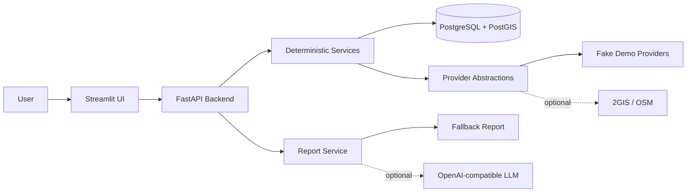

# PlaceFit - PVZ Location Analysis

PlaceFit is a production-oriented local-demo MVP for evaluating one address in
Krasnodar as a pickup point (`pvz`) location. The backend deterministically
calculates competitors, score, confidence, finance, and decision; an LLM, when
enabled, only explains prepared analysis JSON.

Status: **V1.1 stabilization complete**. The normal demo path works without
external API keys and without an LLM key by using fake geodata providers and a
fallback report.

V1.1 is accepted as complete based on stabilization work, documentation
hardening, report/map review, and fresh-clone demo checks. The 30-50 case manual
benchmark remains deferred and should not be described as completed validation
evidence.

## MVP Scope

- One city: Krasnodar.
- One business type: `pvz`.
- One address per analysis.
- Result: score, confidence, finance, decision, report, checklist, map, history.
- Stack: FastAPI backend, PostgreSQL/PostGIS, Streamlit UI, Docker Compose.
- Default demo path: no `DGIS_API_KEY`, no `LLM_API_KEY`, no real provider keys.
- Principle: **AI explains, deterministic code decides**.

## Non-Goals

MVP does not include ML revenue prediction, auth/multi-user mode, Telegram bot,
H3/heatmap, city-wide search, trendwatcher, browser-agent, Avito/Cian parsing,
new business types, or official marketplace compliance checks. PlaceFit does
not guarantee profit and does not replace manual verification.

## Architecture



LLM has no access to the database, shell, external APIs, or secrets. Scoring,
finance, confidence, and decision are calculated only by backend code.

## Tech Stack

- Python 3.11+
- FastAPI, Pydantic v2
- SQLAlchemy 2.x, Alembic
- PostgreSQL 15+ with PostGIS
- Streamlit, Folium, streamlit-folium
- pytest, ruff, mypy
- Docker Compose

## Ports

| Service | URL |
|---|---|
| Backend | <http://localhost:8000> |
| API docs | <http://localhost:8000/docs> |
| Health | <http://localhost:8000/health> |
| Streamlit | <http://localhost:8501> |
| Postgres | `localhost:5432` |

## Quickstart: Fresh Clone With Docker

```bash
git clone https://github.com/Brtwm/PlaceFit.git
cd PlaceFit
cp .env.example .env
docker compose up --build
```

Open the UI:

```text
http://localhost:8501
```

Check backend health:

```bash
curl http://localhost:8000/health
```

Expected response:

```json
{"status":"ok"}
```

The backend service runs `alembic upgrade head` before starting FastAPI.

## Demo Input

The Streamlit analysis page is prefilled with a deterministic demo case:

```json
{
  "address": "Краснодар, ул. Восточно-Кругликовская, 30",
  "business_type": "pvz",
  "rent": 85000,
  "area_m2": 35,
  "floor": 1,
  "first_floor": true,
  "separate_entrance": true,
  "parking": true,
  "signage_possible": true,
  "storage_area": true,
  "repair_condition": "normal",
  "new_residential_area": true,
  "high_density_area": true,
  "bus_stop_nearby": true,
  "good_visibility": true,
  "expected_gross_income_by_user": 360000,
  "investment": 600000,
  "desired_profit": 80000
}
```

You can send the same payload directly:

```bash
curl -X POST http://localhost:8000/api/v1/analyze \
  -H "Content-Type: application/json" \
  -d '{"address":"Краснодар, ул. Восточно-Кругликовская, 30","business_type":"pvz","rent":85000,"area_m2":35,"floor":1,"first_floor":true,"separate_entrance":true,"parking":true,"signage_possible":true,"storage_area":true,"repair_condition":"normal","new_residential_area":true,"high_density_area":true,"bus_stop_nearby":true,"good_visibility":true,"expected_gross_income_by_user":360000,"investment":600000,"desired_profit":80000}'
```

## Verification Commands

Inside the running Compose stack:

```bash
docker compose exec backend pytest -v --tb=short
docker compose exec backend ruff check .
docker compose exec backend mypy app
docker compose exec backend alembic upgrade head
```

Local checks:

```bash
docker compose config
uv run pytest -v --tb=short
uv run ruff check .
uv run mypy app
```

Real provider tests are not part of ordinary test runs. They require explicit
environment setup and the `external` marker.

## Local Run Without Docker

Requirements: Python 3.11+, `uv`, and a running PostgreSQL/PostGIS database.

```bash
cp .env.example .env
uv sync --extra dev
uv run alembic upgrade head
uv run uvicorn app.main:app --reload
```

In another terminal:

```bash
uv run streamlit run ui/streamlit_app.py
```

Use a dedicated `TEST_DATABASE_URL` such as `placefit_test` for local
integration tests.

## Optional Real Providers

The demo does not require real geodata providers. To try 2GIS providers, set
values in `.env` and restart the backend:

```text
GEOCODER_PROVIDER=dgis
POI_PROVIDER=dgis
DGIS_API_KEY=
```

`POI_PROVIDER=osm` can use Overpass for POI search. Real provider tests are
marked `external` and excluded from ordinary pytest runs.

## Optional LLM Report

Fallback reports work by default:

```text
LLM_ENABLED=false
LLM_API_KEY=
```

To use an OpenAI-compatible provider, set:

```text
LLM_ENABLED=true
LLM_PROVIDER=openai_compatible
LLM_BASE_URL=
LLM_API_KEY=
LLM_MODEL=
```

Even with LLM enabled, the model receives only prepared analysis JSON and writes
explanatory text. It does not calculate score, finance, confidence, or decision.

## Roadmap Summary

Detailed future planning lives in [Roadmap](docs/10_roadmap.md).

- **MVP / V1.0**: implemented, local demo ready.
- **V1.1**: stabilization, documentation hardening, report/map review, and
  fresh-clone checks are complete.
- **V1.2**: compare mode and decision support.
- **V1.3**: export and reporting polish.
- **V1.4**: manual refresh and deltas for saved locations.
- **V1.5**: scoring governance and marketplace rule maturity.
- **V2**: city-wide location intelligence for PVZ only.
- **V3**: data-driven ML/B2B/multi-business platform after dataset/backtesting.

Telegram bot, mobile app, browser-agent, unsupported scraping, premature ML,
premature multi-business expansion, and premature React rewrite are deferred.

## Limitations

- PlaceFit does not guarantee profit and is not financial advice.
- `expected_gross_income_by_user` is a user hypothesis, not a system forecast.
- Marketplace requirements require manual verification from official sources.
- Geodata quality depends on provider freshness and coverage.
- Manual competitor checks are approximate evidence, not exact ground truth.
- The 30-50 case manual benchmark is deferred and should not be described as
  completed validation evidence.
- MVP supports only Krasnodar, `pvz`, and one-address analysis.

## Security Notes

- Never commit `.env`.
- Do not put real API keys in README examples, tests, or Docker images.
- API keys must stay in environment variables.
- Real provider keys are optional and not needed for demo/tests.

## Troubleshooting

Port already in use:

```bash
docker compose down
```

Then stop the local process using `8000`, `8501`, or `5432`, or change the host
port mapping in `docker-compose.yml`.

Reset local database volume:

```bash
docker compose down -v
docker compose up --build
```

Streamlit cannot reach backend:

```bash
docker compose ps
docker compose logs --tail=100 streamlit
docker compose logs --tail=100 backend
```

Inside Compose, Streamlit uses
`PLACEFIT_API_BASE_URL=http://backend:8000/api/v1`. For host-local UI runs, use
`http://localhost:8000/api/v1`.

## Documentation

- [Product overview](docs/00_overview.md)
- [MVP scope](docs/02_mvp_scope.md)
- [Architecture](docs/03_architecture.md)
- [Data model](docs/04_data_model.md)
- [API contract](docs/05_api_contract.md)
- [Scoring model](docs/06_scoring_model.md)
- [Financial model](docs/07_financial_model.md)
- [AI report](docs/08_ai_report.md)
- [Testing strategy](docs/09_testing_strategy.md)
- [Roadmap](docs/10_roadmap.md)
- [Historical MVP coding plan](docs/13_coding_plan_for_codex_mvp.md)

## License

MIT License. See [LICENSE](LICENSE).
